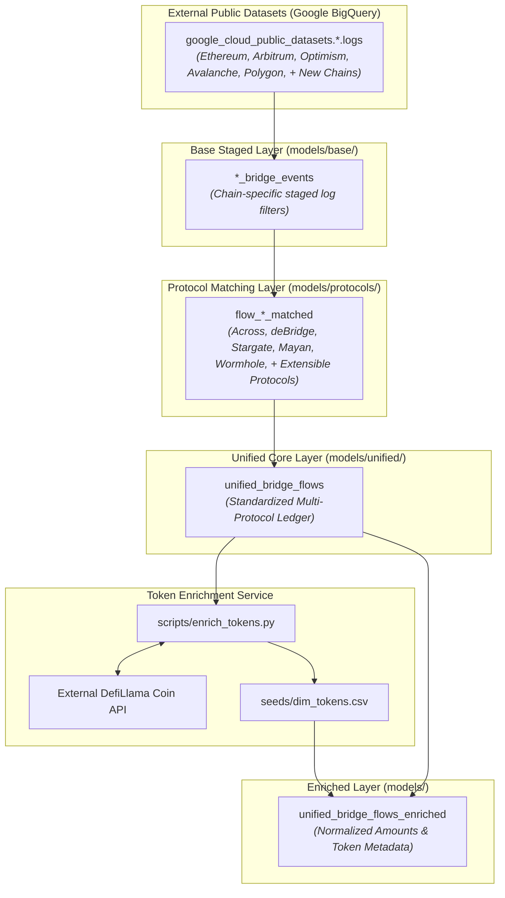

# Cross-Chain Fund & Bridge Analytics Pipeline

A **dbt and Google BigQuery** data pipeline designed to reconcile, correlate, and analyze cross-chain token deposits and fulfillments across EVM networks and bridge protocols into a single, normalized transaction ledger.

---

## Overview
This pipeline answers key liquidity and settlement questions for crypto funds and analytics engineers:
- What is the total bridged volume across chains and protocols?
- What is the end-to-end settlement latency (`time_to_fill_seconds`) per transaction?
- Which cross-chain orders are currently `PENDING` versus `COMPLETED`?

---

## Sample Analytics Output
Representative output from the final enriched analytics dataset (`cross_chain_fund_analytics.unified_bridge_flows_enriched` / `unified_bridge_flows_enriched`):

| bridge_name | correlation_id | status | source_chain | destination_chain | deposit_timestamp | fill_timestamp | time_to_fill_seconds | user_address | token_deposited_symbol | amount_deposited_normalized | token_received_symbol | amount_received_normalized |
| :--- | :--- | :--- | :--- | :--- | :--- | :--- | :--- | :--- | :--- | :--- | :--- | :--- |
| **Across V3** | `1048572` | `COMPLETED` | `ethereum` | `arbitrum` | 2026-08-06 14:10:00 | 2026-08-06 14:10:45 | 45 | `0x1ab...8f9` | `USDC` | 5000.00 | `USDC` | 4998.50 |
| **deBridge DLN** | `0x8f2...e01` | `COMPLETED` | `arbitrum` | `optimism` | 2026-08-06 15:22:10 | 2026-08-06 15:23:02 | 52 | `0x3cd...112` | `WETH` | 2.50 | `WETH` | 2.498 |
| **Stargate V2** | `0xa1b...902` | `COMPLETED` | `avalanche` | `ethereum` | 2026-08-06 16:00:15 | 2026-08-06 16:04:30 | 255 | `0x77a...44c` | `USDT.e` | 1200.00 | `USDT` | 1199.10 |
| **Mayan Swift** | `0x33e...aa9` | `PENDING` | `optimism` | `arbitrum` | 2026-08-06 18:05:12 | `NULL` | `NULL` | `0x990...b12` | `USDC` | 750.00 | `USDC` | 748.50 |
| **Wormhole** | `491028` | `COMPLETED` | `ethereum` | `polygon` | 2026-08-06 19:30:20 | 2026-08-06 19:42:10 | 710 | `0xef0...771` | `WETH` | 0.85 | `WETH` | 0.85 |

---

## Data Ingestion & Architecture

### Ingestion Source Declaration
**Ingestion**: Raw event logs are sourced from Google's public blockchain datasets on BigQuery (`bigquery-public-data.crypto_ethereum` for Ethereum, `bigquery-public-data.goog_blockchain_arbitrum_one_us` for Arbitrum, `bigquery-public-data.goog_blockchain_optimism_mainnet_us` for Optimism, `bigquery-public-data.goog_blockchain_avalanche_contract_chain_us` for Avalanche, and `bigquery-public-data.goog_blockchain_polygon_mainnet_us` for Polygon), rather than running and maintaining our own indexing infrastructure. This lets the project focus engineering effort on the harder, more differentiated problem: cross-chain correlation and reconciliation logic, rather than reinventing log extraction.

> **Known Ingestion Constraint**: Public BigQuery blockchain datasets update asynchronously with live network blocks, introducing an inherent indexing latency of up to several hours compared to real-time mainnet state.

### Lineage Architecture Diagram



---

## Data Model Specifications

Reading directly from `models/**/schema.yml` and model SQL configurations:

| Pipeline Layer | Directory Path | Table Grain | Primary Key | Target Dataset / Schema |
| :--- | :--- | :--- | :--- | :--- |
| **Base Staged Events** | `models/base/` | Single filtered EVM log event per chain | (`transaction_hash`, `log_index`) | `cross_chain_events` |
| **Protocol Matched Flows** | `models/protocols/` | Single correlated cross-chain transfer order per protocol | (`bridge_name`, `correlation_id`, `source_chain`) | `cross_chain_protocol_flows` |
| **Unified Flow Ledger** | `models/unified/` | Standardized multi-protocol transfer ledger | (`bridge_name`, `correlation_id`, `source_chain`) | `cross_chain_unified_flows` |
| **Enriched Analytics Layer** | `models/` | Enriched transfer flow with token metadata & normalized amounts | (`bridge_name`, `correlation_id`, `source_chain`) | `cross_chain_unified_flows` |

---

## Event Correlation Logic (Across V3 Example)

Examining the actual implementation in `macros/across/v2_across_v3_deposits.sql`, `macros/across/v2_across_v3_fills.sql`, and `models/protocols/across/flow_across_matched.sql`:

1. **Deposit Extraction (`v2_across_v3_deposits`)**:
   Filters `V3FundsDeposited` event log (`topic0 = '0xa12...b45'`) on the source chain. It un-packs the 64-character hexadecimal log data parameters to extract:
   - `deposit_id` (`topics[SAFE_OFFSET(2)]`)
   - `input_token` & `input_amount`
   - `destination_chain_id`

2. **Fill Extraction (`v2_across_v3_fills`)**:
   Filters `FilledV3Relay` event log (`topic0 = '0x486...c12'`) on the destination chain to extract:
   - `deposit_id` (`topics[SAFE_OFFSET(2)]`)
   - `output_token` & `output_amount`

3. **Correlation & Status Matching (`flow_across_matched.sql`)**:
   Performs a `LEFT JOIN` between deposits (`d`) and fills (`f`) on `deposit_id`:
   ```sql
   FROM across_deposits d
   LEFT JOIN across_fills f
       ON d.deposit_id = f.deposit_id
   ```
   - If `f.tx_hash IS NOT NULL`, `status` is set to `'COMPLETED'` and `time_to_fill_seconds` calculates `TIMESTAMP_DIFF(f.block_time, d.block_time, SECOND)`.
   - If `f.tx_hash IS NULL`, `status` evaluates to `'PENDING'`, preserving in-flight visibility.

---

## Data Quality & Testing

Data quality assertions are defined in modular `schema.yml` files across every layer of the pipeline:

| Layer | Schema File | Tested Columns | dbt Assertion Types | Purpose |
| :--- | :--- | :--- | :--- | :--- |
| **Base Event Logs** | `models/base/schema.yml` | `transaction_hash`, `log_index` | `not_null` | Prevents null event log entries |
| **Protocol Flows** | `models/protocols/schema.yml` | `correlation_id`, `source_chain`, `status` | `not_null`, `accepted_values: ['PENDING', 'COMPLETED']` | Enforces state machine integrity & non-null correlation IDs |
| **Unified Ledger** | `models/unified/schema.yml` | `bridge_name`, `correlation_id`, `source_chain`, `destination_chain`, `status` | `not_null`, `accepted_values: ['PENDING', 'COMPLETED']` | Guarantees complete cross-chain routing & valid status values |
| **Enriched Layer** | `models/schema.yml` | `bridge_name`, `correlation_id`, `source_chain`, `destination_chain`, `status` | `not_null`, `accepted_values: ['PENDING', 'COMPLETED']` | Ensures output completeness before serving downstream dashboards |

---

## Reliability & Incremental Strategy

### Configured Incremental Strategy
All models explicitly declare `materialized = 'incremental'` and `incremental_strategy = 'merge'` in their `config()` blocks:
- **Base Models**: `unique_key = ['transaction_hash', 'log_index']`
- **Protocol & Unified Models**: `unique_key = ['bridge_name', 'correlation_id', 'source_chain']`

### Unhandled Failure Modes & Known Gaps
1. **Unmatched Dead-Letter Events**: Deposits that are never fulfilled (or canceled on-chain) remain in status `PENDING` indefinitely. There is currently no dead-letter queue table to quarantine expired proposals after $N$ days.
2. **Token Metadata API Fallback**: If the external DefiLlama API fails or an ERC-20 token is unlisted, `scripts/enrich_tokens.py` defaults to symbol `'UNKNOWN'` and decimals `18`.
3. **Partition Scan Bounding**: Pending orders older than 30 days are excluded from the incremental `WHERE` subquery lookup to maintain partition pruning performance.

---

## Environment & Setup

### Required Credentials & Config Files
1. **Google Cloud Credentials**:
   Requires Application Default Credentials (ADC) with BigQuery job creation permissions:
   ```bash
   gcloud auth application-default login
   gcloud auth application-default set-quota-project YOUR_GCP_PROJECT_ID
   ```

2. **`profiles.yml`**:
   Must define the `cross_chain_fund` profile:
   ```yaml
   cross_chain_fund:
     target: prod
     outputs:
       dev:
         type: bigquery
         method: oauth
         project: YOUR_GCP_PROJECT_ID
         dataset: cross_chain
         location: US
         threads: 4
   ```

3. **`dbt_project.yml`**:
   Configures global pipeline variables. The `start_date` variable sets the baseline timestamp filter (`block_timestamp >= var("start_date")`) applied across all base staged event models to bound BigQuery partition scans and control query processing volume:
   ```yaml
   vars:
     start_date: '2026-08-06 00:00:00'
   ```

---

## Orchestration & Pipeline Execution

### Automated Airflow DAG Orchestration
The project includes an Apache Airflow module inside `airflow/` with a DAG ([airflow/dags/cross_chain_pipeline_dag.py](airflow/dags/cross_chain_pipeline_dag.py)) scheduled daily at **02:00 UTC**.

---

## Future Enhancements

These capabilities are **genuinely absent from the current codebase**:
- **Dead-Letter Queue Model**: Quarantine orders pending for $>7$ days into a dedicated `stuck_bridge_flows` model.
- **Non-EVM Chain Ingestion**: Expand log parsing macros to handle Solana and Cosmos bridge events.
