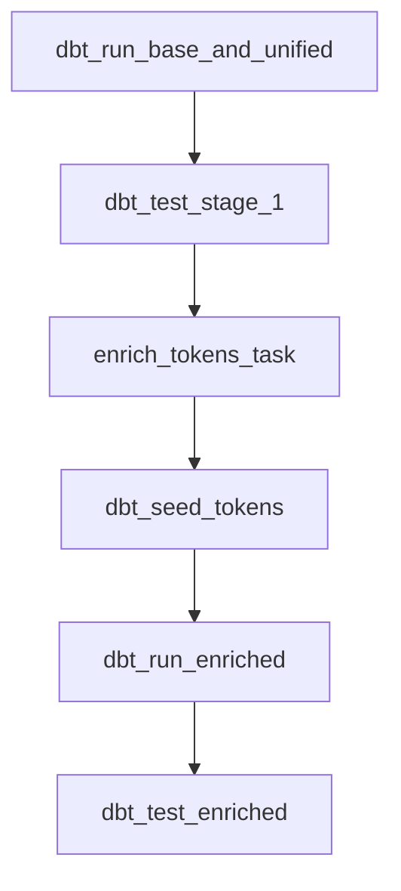

# Apache Airflow Orchestration Module

This directory contains the **Apache Airflow** DAG orchestration setup for automating the daily execution of the `cross_chain_fund` data pipeline.

---

## DAG Architecture & Task Dependencies

The DAG `cross_chain_pipeline_dag` runs daily at **02:00 UTC** and executes the following sequential tasks:



### Task Descriptions:
1. **`dbt_run_base_and_unified`**: Runs `models/base`, `models/protocols`, and `models/unified` incremental models.
2. **`dbt_test_stage_1`**: Executes data quality assertions on `base`, `protocols`, and `unified` models.
3. **`enrich_tokens_task`**: Executes `scripts/enrich_tokens.py` to discover unmapped ERC-20 tokens and fetch metadata via API.
4. **`dbt_seed_tokens`**: Refreshes `dim_tokens` seed data inside Google BigQuery.
5. **`dbt_run_enriched`**: Builds the final enriched gold table `unified_bridge_flows_enriched`.
6. **`dbt_test_enriched`**: Validates data quality assertions on `unified_bridge_flows_enriched`.

---

## How to Run Airflow Locally

### Option 1: Standalone Airflow CLI
```bash
# 1. Set AIRFLOW_HOME environment variable
export AIRFLOW_HOME="$(pwd)/airflow"

# 2. Initialize Airflow Database
uv run airflow db init

# 3. Create an Admin User
uv run airflow users create \
    --username admin \
    --firstname Data \
    --lastname Engineer \
    --role Admin \
    --email admin@crosschain.fund \
    --password admin

# 4. Start Airflow Scheduler and Webserver
uv run airflow scheduler &
uv run airflow webserver --port 8080 &
```

Access the Airflow UI at: `http://localhost:8080`

---

## Production Deployment (Cloud Composer / Astronomer)
To deploy to Google Cloud Composer or Astronomer:
1. Copy `airflow/dags/cross_chain_pipeline_dag.py` to the Composer `dags/` GCS bucket.
2. Ensure `dbt-bigquery` and `google-cloud-bigquery` dependencies are specified in `requirements.txt`.
